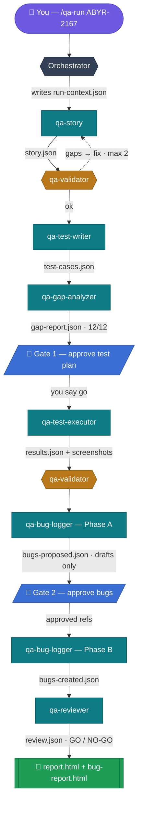

# QA AZM Digital Agent

> An autonomous, multi-agent QA system for **Claude Code** (VS Code) that turns a single Jira story key into a fully executed, evidence-backed, approval-gated QA report.

**Developed by:** Usama Arshad Jadoon &nbsp;·&nbsp; **Role:** QC Lead &nbsp;·&nbsp; **Company:** AZM Digital

---

## What it does

You type one command:

```
/qa-run ABYR-2167
```

…and the agent reads the Jira story, designs the tests, drives your live app in a **real browser**, and hands you a signed-off report — pausing only at two human approval gates. Behind that one command, an **orchestrator** dispatches seven specialist subagents and re-checks every stage with an independent validator.

**On our live run (Jira `ABYR-2167` — “Client Profile View & Risk Results”):** 12 acceptance criteria → 26 test cases → **22 passed · 2 failed · 2 blocked**, 7 findings surfaced, GO ⚠ verdict — with real screenshots captured for every case.

## How the agents work — step by step

Each agent reads the previous stage's file from a shared run folder, does its job, writes its own file for the next agent, and is independently re-checked by the validator before the pipeline advances. Two human gates guard the consequential actions.



> **Legend:** teal = agent · amber = independent validator (loops back on gaps, max 2 retries) · blue = human approval gate · green = published reports. Nothing runs against your app before Gate 1; nothing reaches Jira before Gate 2.

## The pipeline — seven agents + a validator

| # | Agent | Reads → Writes | Job |
|---|-------|----------------|-----|
| 1 | `qa-story` | Jira → `story.json` | Fetch the story; normalize acceptance criteria into atomic, testable items |
| 2 | `qa-test-writer` | `story.json` → `test-cases.json` | Write happy / negative / edge cases per AC |
| 3 | `qa-gap-analyzer` | + → `gap-report.json` | Prove every AC is covered by a real test |
| — | **Gate #1** | — | You approve the test plan before anything runs |
| 4 | `qa-test-executor` | live app → `results.json` + screenshots | Drive the app via Playwright; capture evidence & console errors |
| 5 | `qa-bug-logger` | `results.json` → `bugs-proposed.json` / `bugs-created.json` | Draft detailed bugs (Phase A); create only approved ones in Jira (Phase B) |
| — | **Gate #2** | — | You approve which bugs get filed to Jira |
| 6 | `qa-reviewer` | all → `review.json` | Compute coverage + a GO / NO-GO verdict |
| ★ | `qa-validator` | after every stage | Independently re-check each stage from the source; loop back on gaps (max 2) |

Every subagent runs isolated with no shared memory — all data flows through JSON files in a per-run folder, giving a full audit trail.

## Repository layout

```
qa-agent/
├── commands/            /qa-run and /qa-setup
├── agents/              the 7 qa-* subagents
├── references/          run-folder JSON contract
├── tools/               structural checker
├── install.ps1          deploys agents/commands to ~/.claude
├── qa-config.example.json
└── README.md            full documentation
docs/superpowers/        design spec + implementation plan
```

## Quick start

1. **Authorize connectors** in claude.ai → Settings → Connectors: **Atlassian (Jira)** and **Playwright**.
2. **Install** (Windows PowerShell 5.1):
   ```powershell
   powershell -File qa-agent\install.ps1
   ```
   Copies the 7 agents + 2 commands into `~/.claude` (works in every project).
3. **Configure** your project — run `/qa-setup` (writes `.qa-config.json`, scaffolds a git-ignored `.qa-secrets`, hardens `.gitignore`).
4. **Provide credentials** — fill the git-ignored `.qa-secrets`, or set `$env:QA_USER` / `$env:QA_PASS`.
5. **Run** — `/qa-run <STORY-KEY>` (add `--rerun` to re-test prior failures, `--resume` to continue an interrupted run).

See [`qa-agent/README.md`](qa-agent/README.md) for the complete documentation.

## Safety & credential handling

- **Two human gates** — nothing runs against your app, and nothing is written to Jira, without your approval.
- **Production guard** — a production-looking URL stops the run until explicitly allowed.
- **Credentials never committed** — `.qa-config.json` stores only env-var *names*; real values live in a **git-ignored `.qa-secrets`** file (or OS env vars), are masked in every report/bug, and the executor **auto-deletes the browser snapshot scratch** after each run.
- **Self-correcting** — the validator re-checks every stage and loops back on gaps.
- **Non-destructive** — prefers read/create, reverts edits; retries flaky cases before calling them real bugs.

## Known limitation

The Atlassian MCP has no attachment-upload tool, so bugs reference screenshots by their run-folder path rather than uploading them. The generated `bug-report.html` embeds those screenshots inline for easy sharing.

---

## Credits

**QA AZM Digital Agent** — Developed by **Usama Arshad Jadoon**, QC Lead, **AZM Digital**.
Built on Claude Code with a multi-agent, file-based orchestration architecture.
