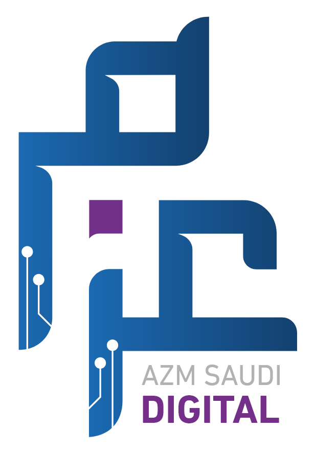
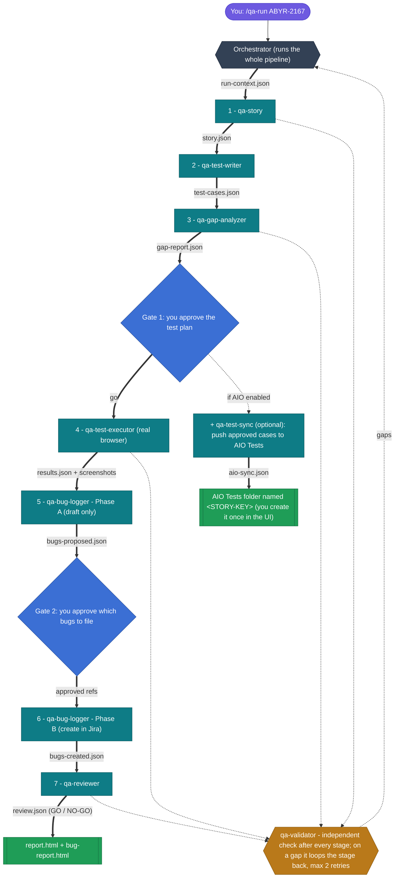

<p align="center">
  
</p>

# QA AZM Digital Agent

> An autonomous, multi-agent QA system for **Claude Code** (VS Code) that turns a single Jira story key into a fully executed, evidence-backed, approval-gated QA report.

**Developed by:** Usama Arshad Jadoon &nbsp;·&nbsp; **Role:** QC Lead &nbsp;·&nbsp; **Company:** AZM Digital

> 📖 **New here? Start with the interactive user guide** — [open it in your browser](https://claude.ai/code/artifact/d10855cc-35e8-4581-a41d-89232fe6f843) (step-by-step walkthrough, live pipeline explorer, real screenshots). It's also in the repo at [`qa-agent/docs/complete-guide.html`](qa-agent/docs/complete-guide.html) and attached to the [latest release](https://github.com/UsamaArshadJadoon/ManualTestingAgent/releases/latest) — download and open it if the hosted link isn't shared with you.

---

## What it does

You type one command:

```
/qa-run ABYR-2167
```

…and the agent reads the Jira story, designs the tests, drives your live app in a **real browser**, and hands you a signed-off report — pausing only at two human approval gates. Behind that one command, an **orchestrator** dispatches the specialist subagents (seven core + an optional **`qa-test-sync`** that mirrors the approved cases into **AIO Tests**) and re-checks every stage with an independent validator.

**On our live run (Jira `ABYR-2167` — “Client Profile View & Risk Results”):** 12 acceptance criteria → 26 test cases → **22 passed · 2 failed · 2 blocked**, 7 findings surfaced, GO ⚠ verdict — with real screenshots captured for every case.

## How the agents work — step by step

Each agent reads the previous stage's file from a shared run folder, does its job, writes its own file for the next agent, and is independently re-checked by the validator before the pipeline advances. Two human gates guard the consequential actions.

> 🔀 **[Open the interactive animated diagram →](https://claude.ai/code/artifact/4a0f6fce-63da-456a-af85-c74d1c415042)** — press **Play** to watch a story flow through every agent, or click any stage to see what it reads and writes.



**How to read it:** the flow runs **top → bottom**, 1 through 7. Each **bold arrow is the file** one agent writes for the next. Diamonds are the **two human gates** (nothing runs against the app before Gate 1; nothing reaches Jira before Gate 2). The amber **qa-validator** independently re-checks every stage and dashed-loops a stage back to the orchestrator if it finds a gap. The dashed **qa-test-sync** branch runs only when `config.aio.enabled` is `true`; it does **not** gate execution and runs once per story.

> 📁 **Prerequisite for AIO sync:** AIO's API can't create folders, so **before the run you create one folder in the AIO *Cases* module named with the story key** (e.g. `ABYR-2167`). `qa-test-sync` finds that folder by name and fills it with the approved cases, each linked to the Jira story. If the folder is missing, the agent stops and tells you the exact name to create, then you re-run it.

**Legend:** 🟣 you · ⬛ orchestrator · 🟢 agent · 🟠 validator · 🔵 human gate · 🟩 published reports.

## The pipeline — seven core agents + a validator (+ optional AIO sync)

| # | Agent | Reads → Writes | Job |
|---|-------|----------------|-----|
| 1 | `qa-story` | Jira → `story.json` | Fetch the story; normalize acceptance criteria into atomic, testable items |
| 2 | `qa-test-writer` | `story.json` → `test-cases.json` | Write happy / negative / edge cases per AC |
| 3 | `qa-gap-analyzer` | + → `gap-report.json` | Prove every AC is covered by a real test |
| — | **Gate #1** | — | You approve the test plan before anything runs |
| + | `qa-test-sync` *(optional)* | `test-cases.json` → `aio-sync.json` | If AIO is enabled: create the approved cases in the story's **AIO Tests** folder (by story key) and link each to the Jira story. Runs once per story; does not gate execution |
| 4 | `qa-test-executor` | live app → `results.json` + screenshots | Drive the app via Playwright; capture evidence & console errors |
| 5 | `qa-bug-logger` | `results.json` → `bugs-proposed.json` / `bugs-created.json` | Draft detailed bugs (Phase A); create only approved ones in Jira (Phase B) |
| — | **Gate #2** | — | You approve which bugs get filed to Jira |
| 6 | `qa-reviewer` | all → `review.json` | Compute coverage + a GO / NO-GO verdict |
| ★ | `qa-validator` | after every stage | Independently re-check each stage from the source; loop back on gaps (max 2) |

Every subagent runs isolated with no shared memory — all data flows through JSON files in a per-run folder, giving a full audit trail.

## Repository layout

```
qa-agent/
├── commands/            /qa-run and /qa-setup
├── agents/              the 7 core qa-* subagents + optional qa-test-sync (AIO)
├── references/          run-folder JSON contract
├── tools/               structural checker
├── install.ps1          deploys agents/commands to ~/.claude
├── qa-config.example.json
└── README.md            full documentation
docs/superpowers/        design spec + implementation plan
```

## Download &amp; install — step by step (for QC members)

You install the agents **once per machine**; after that they work in **every** project via `/qa-run` and `/qa-setup`. Requires **Windows + VS Code + Claude Code** and **PowerShell 5.1**.

### ⚡ Fastest way — download the ZIP &amp; install all agents (copy-paste)

Open **Windows PowerShell** and paste this whole block. It **downloads** the release ZIP, **extracts** it, and **installs all 8 agents + 2 commands** into `~/.claude`:

```powershell
# QA AZM Digital Agent — one-shot download & install
$zip  = "$HOME\Downloads\qa-azm-agent.zip"
$dest = "$HOME\Downloads\qa-azm-agent"
Invoke-WebRequest "https://github.com/UsamaArshadJadoon/ManualTestingAgent/archive/refs/tags/v1.1.0.zip" -OutFile $zip
Expand-Archive $zip $dest -Force
$root = (Get-ChildItem $dest -Directory)[0].FullName
powershell -ExecutionPolicy Bypass -File "$root\qa-agent\install.ps1"
```

Prefer Git? Two lines does the same:

```powershell
git clone https://github.com/UsamaArshadJadoon/ManualTestingAgent.git
powershell -ExecutionPolicy Bypass -File ManualTestingAgent\qa-agent\install.ps1
```

Then **verify** (should list 8 `qa-*` agents):

```powershell
Get-ChildItem $HOME\.claude\agents\qa-*.md | Select-Object Name
```

That's the whole install. Next, [authorize the connectors](#2--authorize-the-connectors) and [set up a project](#5--set-up-a-project-and-run). The detailed manual version of every step follows.

---

### 1 · Get the agent code

Pick either option — both give you the `qa-agent/` folder that holds all 8 agents + 2 commands:

- **Download the release (no Git needed):** open the **[latest release](https://github.com/UsamaArshadJadoon/ManualTestingAgent/releases/latest)** → **Assets** → **Source code (zip)** → download it, then **right-click → Extract All** to a folder (e.g. `C:\ManualTestingAgent`).
- **or clone with Git:**
  ```powershell
  git clone https://github.com/UsamaArshadJadoon/ManualTestingAgent.git
  ```

> The **Source code (zip)** asset *is* the agent code — it contains the whole repo, including `qa-agent\agents\` (the 8 `qa-*` agents), `qa-agent\commands\` (`qa-run`, `qa-setup`), and `qa-agent\install.ps1`.

### 2 · Authorize the connectors

In **claude.ai → Settings → Connectors**, authorize **Atlassian (Jira)** and **Playwright**. (Atlassian is also used by `qa-test-sync` to link AIO cases to the story.)

### 3 · Install the agents

Open **Windows PowerShell** *inside the extracted/cloned folder* (the one that contains `qa-agent\`) and run:

```powershell
powershell -File qa-agent\install.ps1
```

This copies the **8 agents + 2 commands** into `~/.claude` so they are available in every project. It prints each agent and command it installs.

### 4 · Verify the install

```powershell
Get-ChildItem $HOME\.claude\agents\qa-*.md
Get-ChildItem $HOME\.claude\commands\qa-*.md
```

You should see the 8 `qa-*` agents (`qa-story`, `qa-test-writer`, `qa-gap-analyzer`, `qa-test-executor`, `qa-bug-logger`, `qa-reviewer`, `qa-validator`, `qa-test-sync`) and the 2 commands (`qa-run`, `qa-setup`).

### 5 · Set up a project and run

1. In the project you want to test, run `/qa-setup` (writes `.qa-config.json`, scaffolds a git-ignored `.qa-secrets`, hardens `.gitignore`).
2. **Provide credentials** — fill the git-ignored `.qa-secrets`, or set `$env:QA_USER` / `$env:QA_PASS`.
3. *(Optional — AIO Tests)* set `aio.enabled: true` in `.qa-config.json`, add `AIO_TOKEN` to `.qa-secrets`, and **create a folder named with the story key** (e.g. `ABYR-2167`) in the AIO **Cases** module — `qa-test-sync` fills that folder with the approved cases.
4. **Run** — `/qa-run <STORY-KEY>` (add `--rerun` to re-test prior failures, `--resume` to continue an interrupted run).

> **Updating later:** to get a newer version, download/clone again and re-run `powershell -File qa-agent\install.ps1` — it overwrites the deployed copies with the latest.

See [`qa-agent/README.md`](qa-agent/README.md) for the complete documentation.

## Safety & credential handling

- **Two human gates** — nothing runs against your app, and nothing is written to Jira, without your approval.
- **Production guard** — a production-looking URL stops the run until explicitly allowed.
- **Credentials never committed** — `.qa-config.json` stores only env-var *names*; real values live in a **git-ignored `.qa-secrets`** file (or OS env vars), are masked in every report/bug, and the executor **auto-deletes the browser snapshot scratch** after each run.
- **Self-correcting** — the validator re-checks every stage and loops back on gaps.
- **Non-destructive** — prefers read/create, reverts edits; retries flaky cases before calling them real bugs.

## Known limitation

The Atlassian MCP has no attachment-upload tool, so bugs reference screenshots by their run-folder path rather than uploading them. The generated `bug-report.html` embeds those screenshots inline for easy sharing.

---

## Credits

**QA AZM Digital Agent** — Developed by **Usama Arshad Jadoon**, QC Lead, **AZM Saudi Digital**.
Built on Claude Code with a multi-agent, file-based orchestration architecture.
